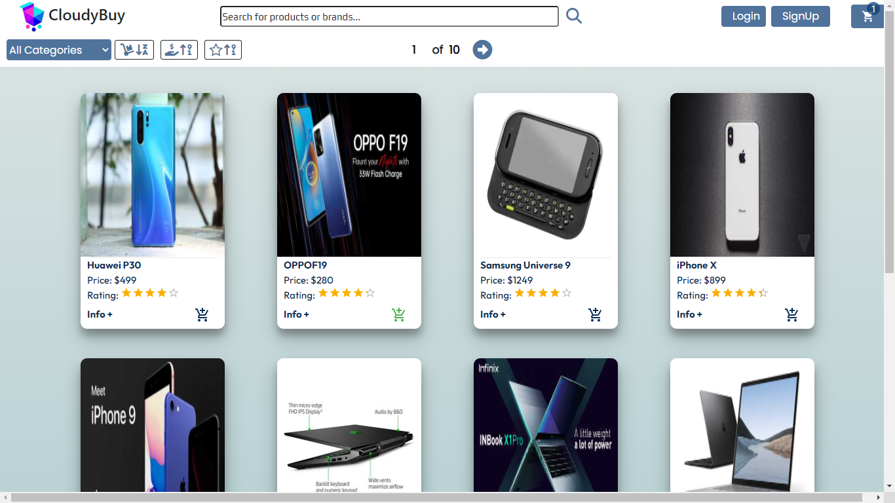

# Final Project - Ecommerce

  

## Objetivos del Proyecto  
  

Crear una aplicación para Ecommerce en la cual se puedan manejar productos por categorias y a partir de ella poder, entre otras cosas:

- Ver la lista completa de productos (catálogo), para ver todo lo disponible para comprar.
- Refinar el listado por categorías, para poder ver los items en los que estoy interesado.
- Buscar productos, para poder encontrar rápido los que quiero comprar.
- ver los detalles de un producto individual (incluida las fotos, descripciones, reviews, etc...), asi puede determinar si quiero ese producto o no.
- Poder crear y editar productos, con nombre, descripción, precio y uno o más fotos, tal que los visitantes puedan ver la última información de lo que se vende.
- Poder agregar o sacar categorías de los items (los items deben poder aceptar múltiples categorías).
- Poder utilizar las categorías, para que los usuarios puedan filtrar los items.
- Gestionar la disponibilidad de un item (stock) . (un item que no esta disponible, no deberá estar listado en la página, pero su detalle debe seguir siendo accesible desde el historial de compras o con su URL, pero debe mencionar que el item no está disponible).
- Poder dejar reviews a los productos, que incluyan texto y un sistema de cinco estrellas.
- Poder agregar o eliminar items a mi carrito de compras desde el listado o desde a página de detalles de un producto, para poder comprarlos despues.
- Editar cantidades de los items de mi carrito, en caso que quiera mas o menos cantidad de un item en particular.
- Poder comprar todos los items de un mi carrito. (checkout)
- Especificar una dirección de envio y un email cuando hago el checkout, asi me envien la compra a lugar que dije.
- Recibir un email de confirmación que hice la compra.
- Poder ver una lista de todas las ordenes, para poder ver y revisar las ordenes.
- Ver los detalles de una orden específica, asi puedo revisarla y actualizar su estado
- Poder cambiar el estado de una orden (creada => procesando || cancelada, procesando => cancelada || completa).
- Poder filtrar las ordenes por su estado (creada, procesando, cancelada, completa).
- Ver el historial de ordenes previas, asi puede reever las ordenes que hice en el pasado.
- Ver los detalles de una orden que hice en el pasado, incluyendo: items comprados, cantidades.
- Poder pagar mi orden usando una pasarela de pago (ej: MercadoPago, Stripe, etc..).
- Poder crear, modificar, inactivar cuentas de usuario, o convertirlos en administrador
- Poder loguearse con usuarios de redes sociales.
- Poder agregar, ver y sacar productos de mi wishlist.
  

   

## Tecnologias y herramientas utilizadas  
<table><tr><td valign="top" width="33%">

### Frontend  

  
  
  
  
  
  

</td><td valign="top" width="33%">

### Backend  

  
  
  
  
  

</td><td valign="top" width="33%">

### DevOps  

  
   
  

</td></tr></table>  

   

## Requisitos para ejecutarla localmente  
  

- clonar el repositorio en un directorio local
- Instalar PostgreSQL
- Crear una base de datos con nombre ecommerce
- Crear una cuenta en la pagina de mercado pago y obtener las API necesarias para utlizar la pasarela de pagos.
- Crear una cuenta en la pagina JWT y obtener las key requeridas para implementar JWT
- Dentro de la carpeta ./api crear un archivo .env para definir las credenciales de acceso a la base de datos, a la pasarela de mercado pago, definir un password para el usuario administrador, como se muestra a continuacion:

DB_USER=userDB
DB_PASSWORD=passwordDB
DB_HOST=localhost
JWT_KEY=JWT_KEY
ADMIN_PASS=password-admin

- Remplazar userDB y passwordDB con sus propias credenciales para conectarse a la base de datos.
- Remplazar JWT_KEY con la key obtenida de la pagina de JWT
- Remplazar password-admin por la password que desee.
  
Crear una cuenta dentro de la pagina de AUT0  obtener las key, necesarias para poder implementar la autenticacion de redes sociales a travez de este SDK

- Dentro de la carpeta ./client crear un archivo .env para definir las credenciales de acceso a la SDK AUT0, como se muestra a continuacion:

REACT_APP_AUTH0_DOMAIN=dev-key_domain
REACT_APP_AUTH0_CLIENT_ID=key_client_id

- Reemplazar dev-key_domain y key_client_id, por las key obtenidas en AUT0

## Instalacion  
  

Utilice el administrador de paquetes npm para intalar los moulos de nodejs necesarios para la aplicacion en tanto para el FrontEnd en la carpeta ./client, con en el BackEnd en la carpeta ./api.
Ejecutar los siguientes comandos en cada carpeta:
- npm install
- npm start

Finalmente ingresar al navedor de internet y ejecutar la aplicaion ingresando la URL

/localhost:3000
